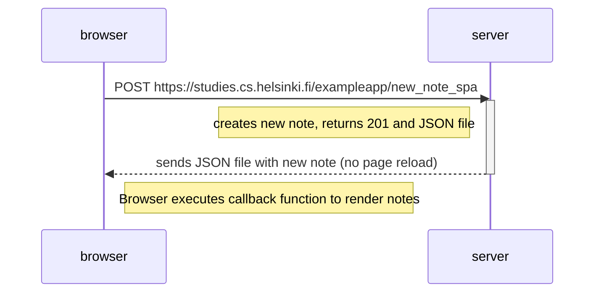

```mermaid
    sequenceDiagram
        participant browser
        participant server

    browser->>server: POST https://studies.cs.helsinki.fi/exampleapp/new_note_spa
    activate server
    Note left of server: creates new note, returns 201 and JSON file
    server-->>browser: sends JSON file with new note (no page reload)
    deactivate server

    Note right of browser: Browser executes callback function to render notes
```